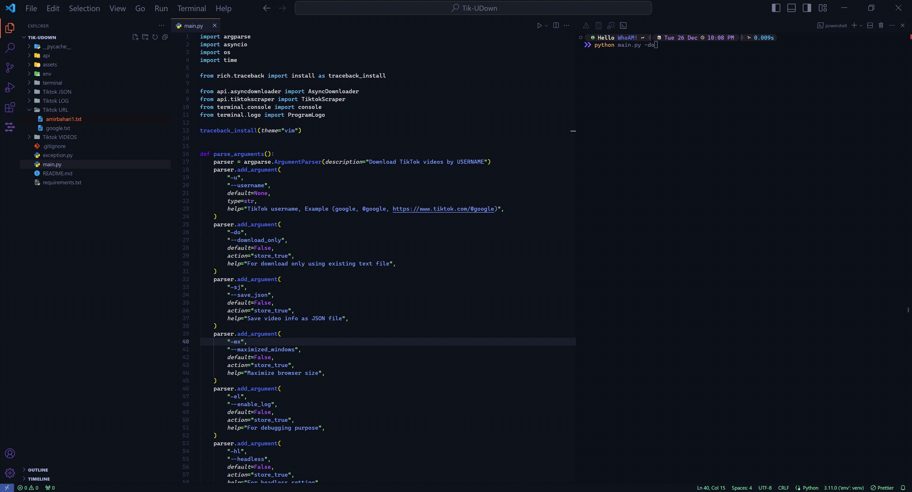

<div align="center">


**Tik-UDown** is a tool specifically designed for scraping TikTok videos by `username` and download it asynchronously.


</div>

## Installation

```
git clone https://github.com/x404xx/Tik-UDown.git
cd Tik-UDown
virtualenv env
env/scripts/activate
pip install -r requirements.txt
```

## Supported Usernames

```
[>] google
[>] @google
[>] https://www.tiktok.com/@google
```

## Features

```
[>] Scraping URLs with donwloading
[>] Download only using an existing file
```

## Usage

```
usage: main.py [-h] [-u USERNAME] [-do] [-sj] [-mx] [-el] [-hl] [-ts] [-ic]

Download TikTok videos by USERNAME

options:
  -h, --help            show this help message and exit
  -u USERNAME, --username USERNAME
                        TikTok username, Example (google, @google,
                        https://www.tiktok.com/@google)
  -do, --download_only  For download only using an existing text file
  -sj, --save_json      Save video info as JSON file
  -mx, --maximized_windows
                        Maximize browser size
  -el, --enable_log     For debugging purpose
  -hl, --headless       For headless setting
  -ts, --transient      Close the progress bar after all the downloads/tasks
                        are finished
  -ic, --instant_clear  Close the progress bar immediately after one task is
                        completed
```

-   **Command-Line Example:**

    ```
    python main.py -u google
    ```

-   **Download Only (Use the UP/DOWN keys to select a file, then press 'ENTER'):**

    ```
    python main.py -do
    ```

    

## Example

```python
import argparse
import asyncio
import os
import time

from rich.traceback import install as traceback_install

from api.asyncdownloader import AsyncDownloader
from api.tiktokscraper import TiktokScraper
from terminal.console import console
from terminal.logo import ProgramLogo

traceback_install(theme="vim")


def parse_arguments():
    parser = argparse.ArgumentParser(description="Download TikTok videos by USERNAME")
    parser.add_argument(
        "-u",
        "--username",
        default=None,
        type=str,
        help="TikTok username, Example (google, @google, https://www.tiktok.com/@google)",
    )
    parser.add_argument(
        "-do",
        "--download_only",
        default=False,
        action="store_true",
        help="For download only using an existing text file",
    )
    parser.add_argument(
        "-sj",
        "--save_json",
        default=False,
        action="store_true",
        help="Save video info as JSON file",
    )
    parser.add_argument(
        "-mx",
        "--maximized_windows",
        default=False,
        action="store_true",
        help="Maximize browser size",
    )
    parser.add_argument(
        "-el",
        "--enable_log",
        default=False,
        action="store_true",
        help="For debugging purpose",
    )
    parser.add_argument(
        "-hl",
        "--headless",
        default=False,
        action="store_true",
        help="For headless setting",
    )
    parser.add_argument(
        "-ts",
        "--transient",
        default=False,
        action="store_true",
        help="Close the progress bar after all the downloads/tasks are finished",
    )
    parser.add_argument(
        "-ic",
        "--instant_clear",
        default=False,
        action="store_true",
        help="Close the progress bar immediately after one task is completed",
    )
    return parser.parse_args()


def timer_wrapper(coroutine):
    async def wrapper(*args, **kwargs):
        start_time = time.time()
        await coroutine(*args, **kwargs)
        elapsed_time = time.time() - start_time
        console.print(f"\n[green]Total elapsed time: {elapsed_time:.2f} seconds[/]\n")

    return wrapper


@timer_wrapper
async def main():
    os.system("cls" if os.name == "nt" else "clear")
    args = parse_arguments()
    if args.download_only:
        ProgramLogo.setup_logo()
        await AsyncDownloader(
            username=args.username,
            save_json=args.save_json,
            transient=args.transient,
            instant_clear=args.instant_clear,
        )
    else:
        if not args.username:
            os.system("python main.py -h" if os.name == "nt" else "python3 main.py -h")
            return

        tiktok_scraper = TiktokScraper(
            channel_url=args.username,
            headless=args.headless,
            enable_log=args.enable_log,
            max_windows=args.maximized_windows,
        )
        username = tiktok_scraper.get_username
        tiktok_scraper.scrape_video_link()
        await AsyncDownloader(
            username=username,
            save_json=args.save_json,
            transient=args.transient,
            instant_clear=args.instant_clear,
        )


if __name__ == "__main__":
    asyncio.run(main())
```

## **Legal Disclaimer**

> This was made for educational purposes only, nobody which directly involved in this project is responsible for any damages caused. **_You are responsible for your actions._**
